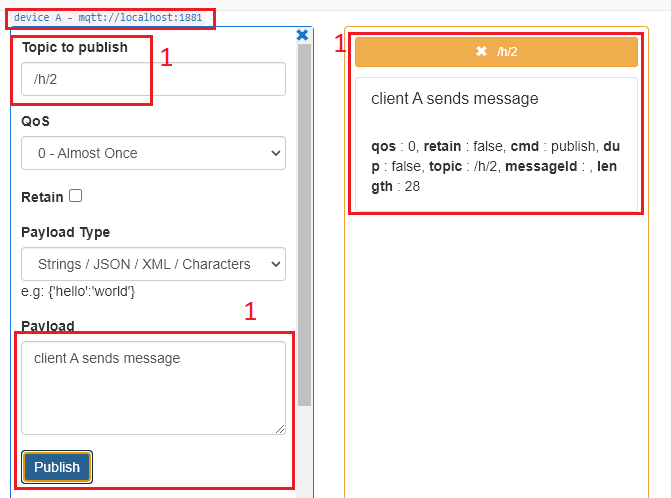
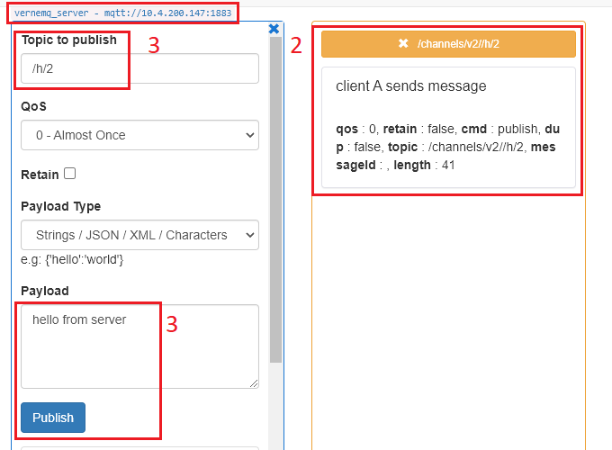
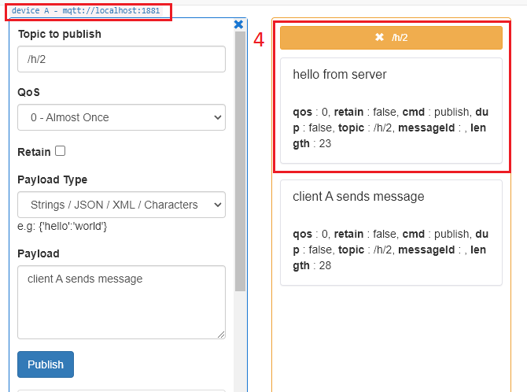

# Tạo file môi trường env.list:

ADAPTER_MQTT_PORT=1881

MQTT_HOST=mqtt://10.16.151.155:1883

USER_NAME_DEFAULT=mirav2

PASSWORD_DEFAULT=password

CHANNEL_DEFAULT=/h/2

CHANNEL_RECEIVE_DEFAULT=/channels/v2/

# Run cmd

docker run --expose 1881 -p 1881:1881 --env-file ./env.list linhnln/mqtt_adpter_nodejs:latest

# Sử dụng

1. Client bên ngoài subcribe topic /h/2 và gửi message đến /h/2
   
2. Vernemq client nhận được message từ topic /channels/v2/h/2
   
3. Vernemq client gửi message đến /h/2
4. Client bên ngoài nhận được message từ topic /h/2
   
